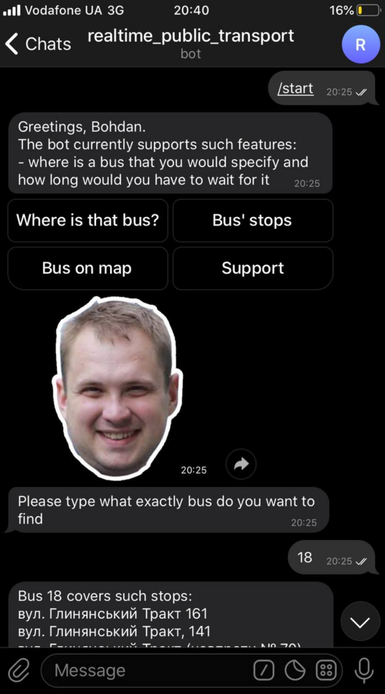
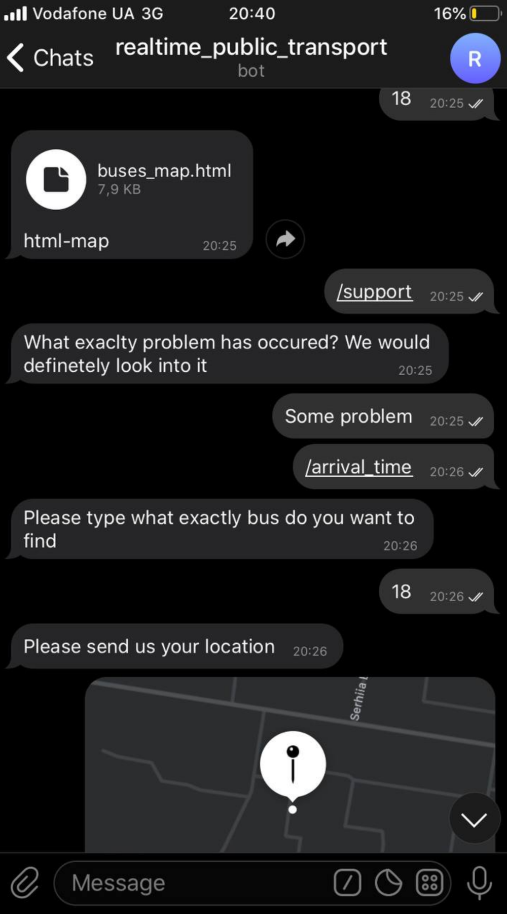
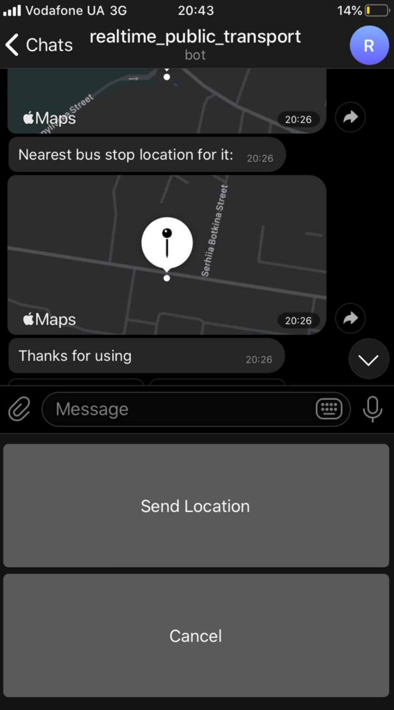
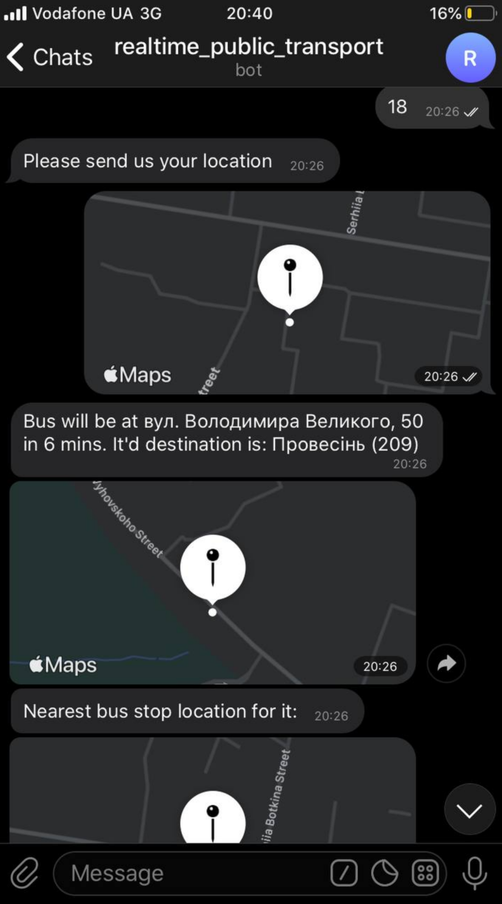
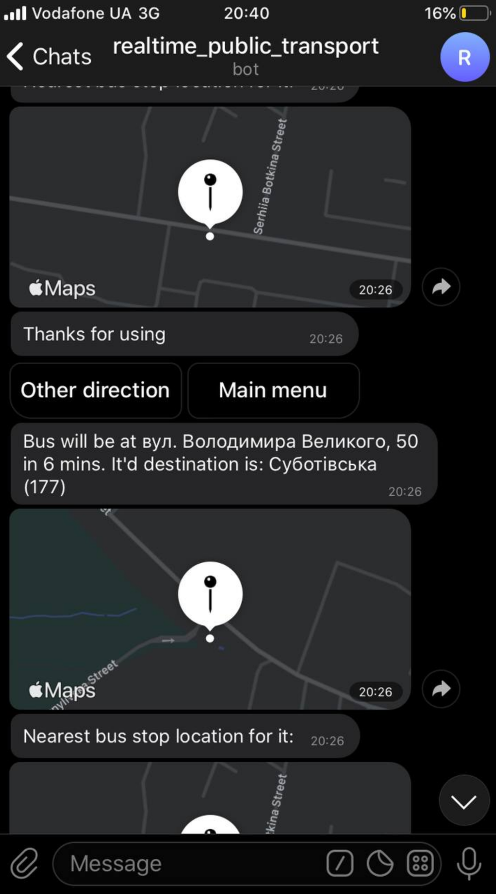

## One telegram bot to ~~rule them all~~ show where that bus is


<details open="open">
  <summary>Table of Contents</summary>
  <ol>
    <li>
      <a href="#about-the-project">About The Project</a>
      <ul>
        <li><a href="#built-with">Built With</a></li>
      </ul>
    </li>
    <li>
      <a href="#getting-started">Getting Started</a>
      <ul>
        <li><a href="#prerequisites">Prerequisites</a></li>
        <li><a href="#installation">Installation</a></li>
      </ul>
    </li>
    <li><a href="#usage">Usage</a></li>
  </ol>
</details>


<!-- ABOUT THE PROJECT -->
## About The Project

Study case telegram bot, that will conveniently display inforamtio about Lviv's public transport

Information about transport is taken from the government site. It is open and free, so everyone may try it.

### Built With

This section should list any major frameworks that you built your project using. Leave any add-ons/plugins for the acknowledgements section. Here are a few examples.
* [pytelegrambotapi](https://github.com/eternnoir/pyTelegramBotAPI)
* [pandas](https://github.com/pandas-dev/pandas) - to parse the information on the transport
* [google api](https://www.google.com/url?sa=t&rct=j&q=&esrc=s&source=web&cd=&ved=2ahUKEwi2jYy0xLDxAhVrwIsKHQYyC2cQyCkwAHoECAQQAw&url=https%3A%2F%2Fwww.youtube.com%2Fwatch%3Fv%3DdQw4w9WgXcQ&usg=AOvVaw0aHtehaphMhOCAkCydRLZU) - to predict how long will it take for the bus to arrive at the bus stop, taking into account the current state of traffic. 


<!-- GETTING STARTED -->
## Getting Started

To get a local copy up and running follow these simple example steps.

### Prerequisites

This is an example of how to list things you need to use the software and how to install them.
* npm
  ```sh
  pip install -r requirements.txt
  ```

### Installation

1. Get a free API Key at [get api](https://developers.google.com/maps/documentation/javascript/get-api-key?hl=ru)
2. Clone the repo
   ```sh
   git clone https://github.com/your_username_/Project-Name.git
   ```
3. Create and enter your API in `config.py`
   ```python
   TOKEN = 'your_token' # you can get it from the BotFather
   GoogleAPI = 'your_api'
   ```


<!-- USAGE EXAMPLES -->
## Usage
Usage example:
<table width="100%" border="0">
  <tr>    
  <td></td>
  <td></td>
  <td></td>
  </tr>
</table>

<table width="100%" border="0">
  <tr>    
  <td></td>
  <td></td>
  </tr>
</table>

<!-- CONTRIBUTING -->
## Contributing

Contributions are what make the open source community such an amazing place to be learn, inspire, and create. Any contributions you make are **greatly appreciated**.

1. Fork the Project
2. Create your Feature Branch (`git checkout -b feature/AmazingFeature`)
3. Commit your Changes (`git commit -m 'Add some AmazingFeature'`)
4. Push to the Branch (`git push origin feature/AmazingFeature`)
5. Open a Pull Request


<!-- LICENSE -->
## License

Distributed under the MIT License. See `LICENSE` for more information.


